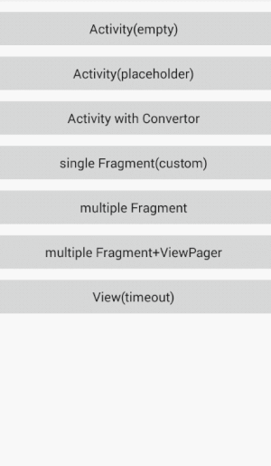
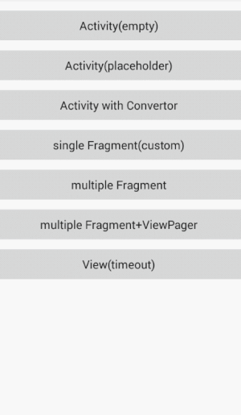
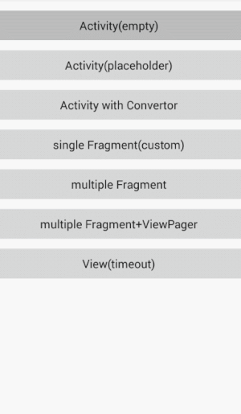

<div align="center"></div>

LoadSir
---
English | [中文](README-cn.md)

`LoadSir` is a lightweight, good expandability android library used for show diffent load page depend on diffent callback when you do net job .

Preview
---
| **in Activity**|**in View**|**in Fragment**|
|:---:|:----:|:----:|
||||

| **Placeholder**|**Muitl-Fragment**|**ViewPage+Fragment**|
|:---:|:----:|:----:|
||||


Feature
---
* :star:support for Activity，Fragment，Fragment(v4)，View
* :star:support for muitl-Fragment，Fragment+ViewPager
* :star:convert some other object or data structure into an Callback
* :star:only load one layout once
* :star:don't need to set enum or constant for status code
* :star:be able to set the your own onclick logic in custom Callback
* :star:no preloaded load page
* be able to set the retry onclick listener
* cusomize your own load page
* thread-safety
* be able to set the default load page
* be able to add muitl load pages
* single config object

Getting started
---
### Download

```groovy
compile 'com.kingja.loadsir:loadsir:1.1.1'
```

### Config

* ###### Global Config
set config with singleton pattern, you can do it in your Application.
```java
public class App extends Application {
    @Override
    public void onCreate() {
        super.onCreate();
        LoadSir.beginBuilder()
                .addCallback(new ErrorCallback())
                .addCallback(new EmptyCallback())
                .addCallback(new LoadingCallback())
                .addCallback(new TimeoutCallback())
                .addCallback(new CustomCallback())
                .setDefaultCallback(LoadingCallback.class)
                .commit();
    }
}
```
* ###### Single Config
if your want to build another specific LoadSir, you can set config like this.

```java
LoadSir loadSir = new LoadSir.Builder()
                .addCallback(new LoadingCallback())
                .addCallback(new EmptyCallback())
                .addCallback(new ErrorCallback())
                .build();
        loadService = loadSir.register(this, new Callback.OnReloadListener() {
            @Override
            public void onReload(View v) {
                // retry logic
            }
        });
```
### Register

* ###### Register in Activity

```java
@Override
protected void onCreate(@Nullable Bundle savedInstanceState) {
    super.onCreate(savedInstanceState);
    setContentView(R.layout.activity_content);
    // Your can change the callback on sub thread directly.
    LoadService loadService = LoadSir.getDefault().register(this, new Callback.OnReloadListener() {
        @Override
        public void onReload(View v) {
            // retry logic
        }
    });
}}
```

* ###### Register in View
```java
ImageView imageView = (ImageView) findViewById(R.id.iv_img);
LoadSir loadSir = new LoadSir.Builder()
        .addCallback(new TimeoutCallback())
        .setDefaultCallback(LoadingCallback.class)
        .build();
loadService = loadSir.register(imageView, new Callback.OnReloadListener() {
    @Override
    public void onReload(View v) {
        loadService.showCallback(LoadingCallback.class);
        // retry logic
    }
});
```

* ###### Register in Fragment
use it in Fragment is a bit different from others, see the template code.
```java
@Nullable
@Override
public View onCreateView(LayoutInflater inflater, @Nullable ViewGroup container, @Nullable Bundle
        savedInstanceState) {
    //step 1：obtain get root view
    rootView = View.inflate(getActivity(), R.layout.fragment_a_content, null);
    //step 2：obtain the LoadService
    LoadService loadService = LoadSir.getDefault().register(rootView, new Callback.OnReloadListener() {
        @Override
        public void onReload(View v) {
            // retry logic
        }
    });
    //step 3：return the LoadLayout from LoadService
    return loadService.getLoadLayout();
}
```

### Callback

* ###### Direct Callback
```java
protected void loadNet() {
        // do net job...
        // callback
        loadService.showSuccess();//successful case
        loadService.showCallback(EmptyCallback.class);//other case
    }
```
* ###### Convertor Callback (recommended )
if you want LoadSir do callback automatically, you can pass a Convertor when you register it.

```java
LoadService loadService = LoadSir.getDefault().register(this, new Callback.OnReloadListener() {
    @Override
    public void onReload(View v) {
         // retry logic
    }}, new Convertor<HttpResult>() {
    @Override
    public Class<? extends Callback> map(HttpResult httpResult) {
        Class<? extends Callback> resultCode = SuccessCallback.class;
        switch (httpResult.getResultCode()) {
            case SUCCESS_CODE:
                if (httpResult.getData().size() == 0) {
                    resultCode = EmptyCallback.class;
                }else{
                    resultCode = SuccessCallback.class;
                }
                break;
            case ERROR_CODE:
                resultCode = ErrorCallback.class;
                break;
        }
        return resultCode;
    }
});
```
pass a HttpResult
```java
loadService.showWithConvertor(httpResult);
```

### Customize

public class CustomCallback extends Callback {

    @Override
    protected int onCreateView() {
        return R.layout.layout_custom;
    }

    @Override
    protected boolean onRetry(Context context, View view) {
        Toast.makeText(context.getApplicationContext(),"Hello mother fuck! :p",Toast.LENGTH_SHORT).show();
        return true;//return true to cover the retry logic when you register
    }
}


## Changelog

**v1.1.1**
- Initial release .

## Communication
Any questions,Welcome to contact me.
* [Blog](http://www.jianshu.com/u/8a1a8ed656e8)
* email:kingjavip@gmail.com

## License

    Copyright 2017 KingJA

    Licensed under the Apache License, Version 2.0 (the "License");
    you may not use this file except in compliance with the License.
    You may obtain a copy of the License at

        http://www.apache.org/licenses/LICENSE-2.0

    Unless required by applicable law or agreed to in writing, software
    distributed under the License is distributed on an "AS IS" BASIS,
    WITHOUT WARRANTIES OR CONDITIONS OF ANY KIND, either express or implied.
    See the License for the specific language governing permissions and
    limitations under the License.